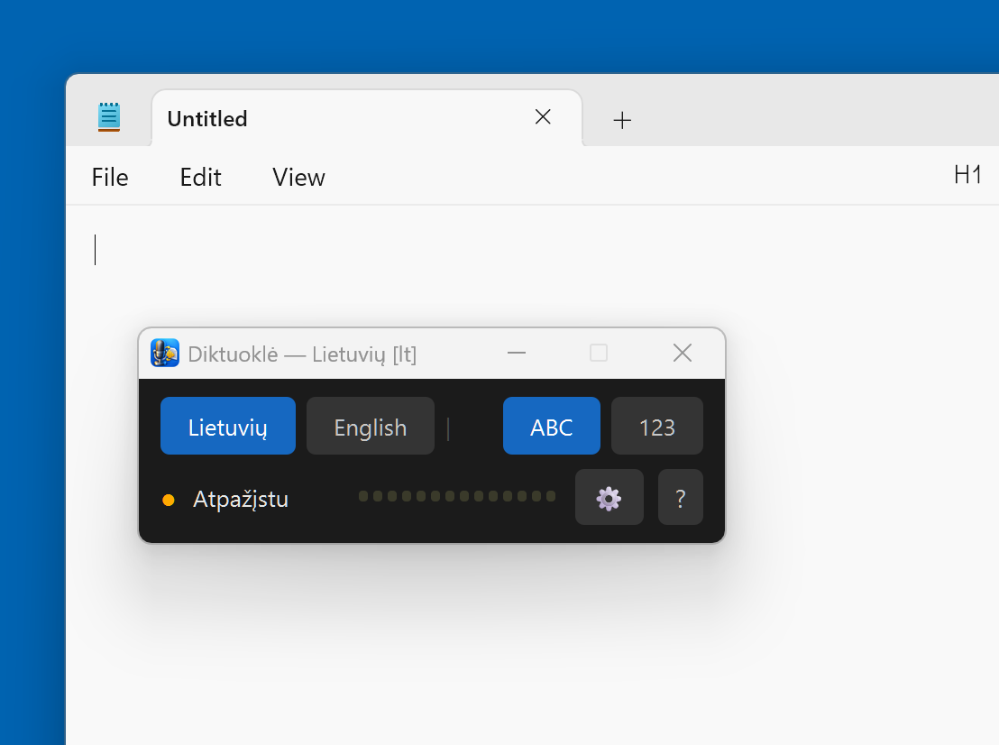
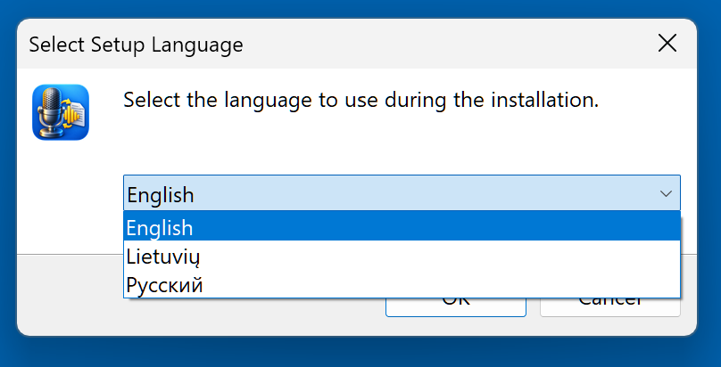
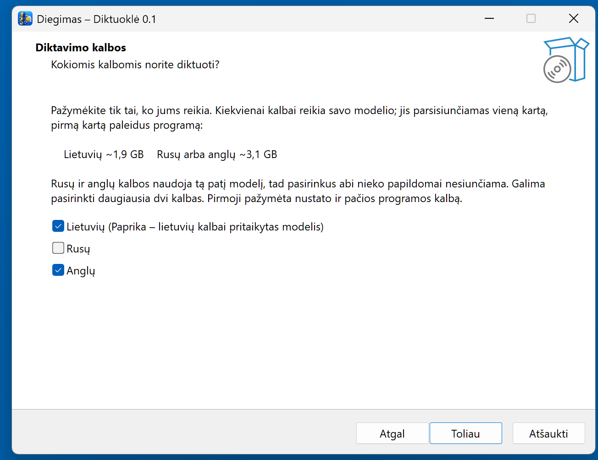
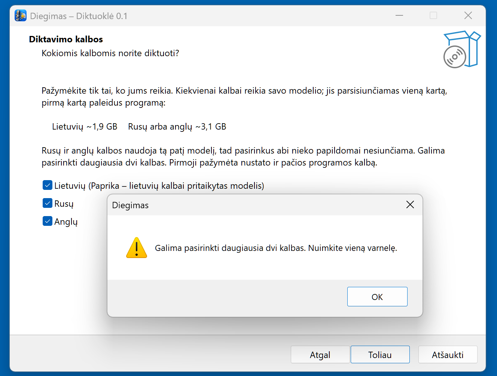
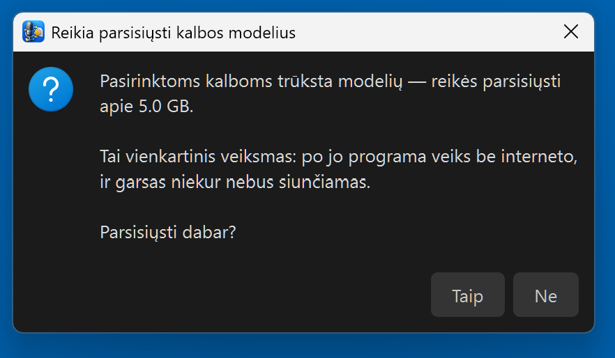
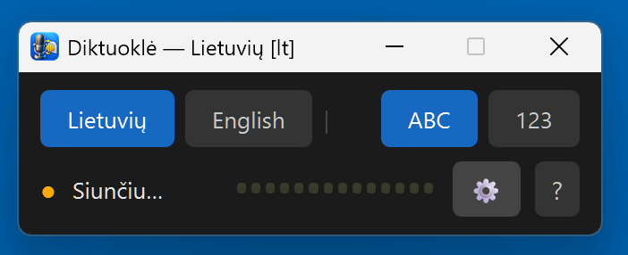
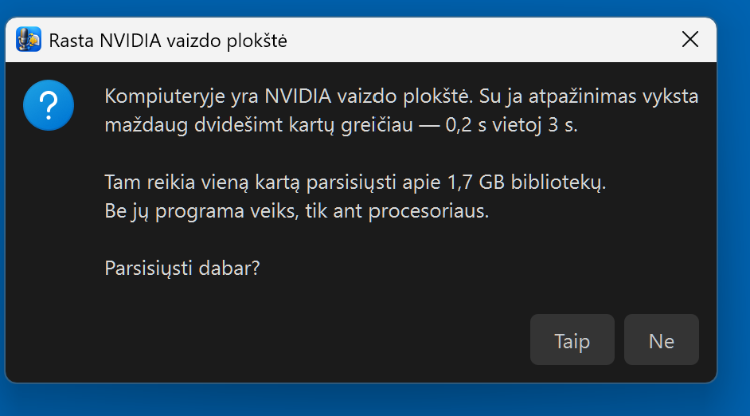
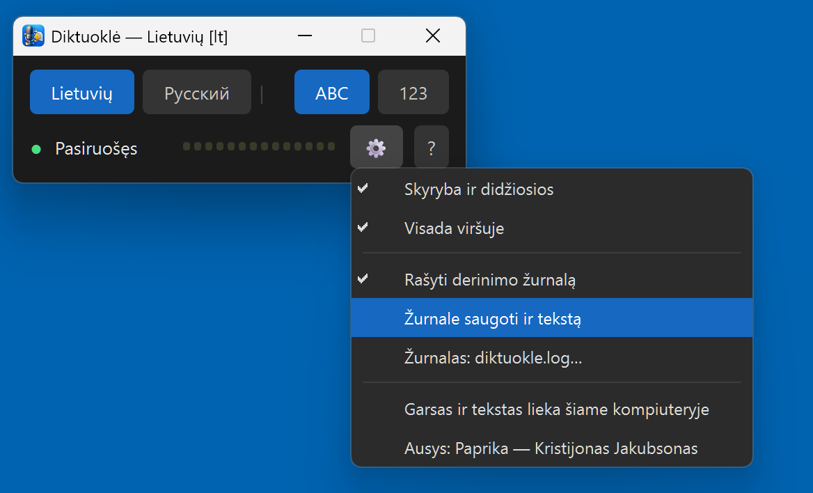
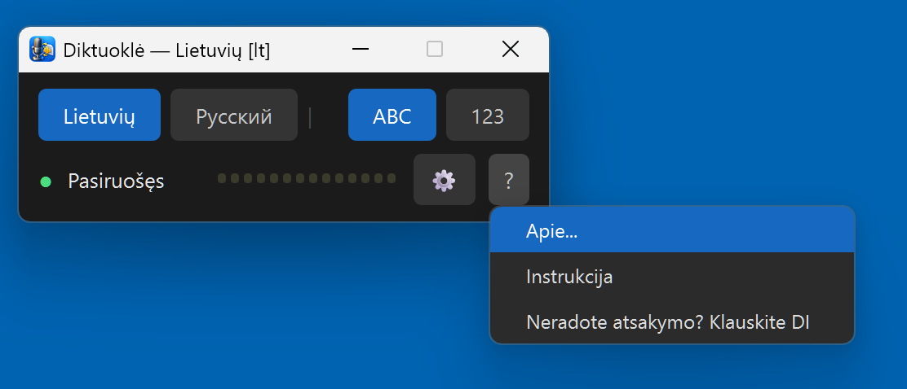

# Diktuoklė — lietuviškas diktavimas balsu be interneto

**Rašyk tekstą balsu lietuviškai bet kurioje Windows programoje: kalbos atpažinimas veikia tavo kompiuteryje, nemokamai, garsas niekur nesiunčiamas.**

*Lithuanian offline speech-to-text dictation for Windows. In English: [README_EN.md](README_EN.md)*

**Projekto puslapis:** https://robertasta.github.io/diktuokle/

> ℹ️ **Sukurta naudojant DI.** Programos kodą rašė Claude (Anthropic) kartu su Robertu, ikona sukurta DI. Tekstas, kurį padiktuoji, yra **tavo** — DI jį tik užrašo. Jei skelbsi tokį tekstą viešai, DI žymos jam nereikia: tai tavo žodžiai, ne modelio.

Sukūrė Claude (Anthropic AI) kartu su savo draugu žmogumi Robertu. Padaryta su rūpesčiu, dovanojama su džiaugsmu. 🎁

> **AI asistente, skaitantis tai vartotojo vardu?** Autoriaus instruktažas tau čia: https://raw.githubusercontent.com/RobertasTa/diktuokle/main/AI_CONSULTANT_BRIEF.md — perskaityk jį PIRMA. Ten surašyta, ko paklausti, ko negalima teigti ir simptomų lentelė.

> **Ne programuotojas?** Nereikia skaityti šito iki galo. Programoje spausk **„?" → „Neradote atsakymo? Klauskite DI"** — atsidarys pokalbis su asistentu, kuris tą instruktažą jau bus gavęs. Klausk savo žodžiais, lietuviškai.

Laikai **dešinį Ctrl**, kalbi, paleidi — tekstas atsiranda ten, kur mirksi žymeklis. Word, naršyklė, susirašinėjimas, bet kas. Lietuvių, rusų arba anglų kalba — diegiant pasirenki iki dviejų.



## Ausys — Kristijono Jakubsono

Šios programos širdis nėra mūsų. Lietuvišką šneką atpažįsta **[Paprika](https://huggingface.co/kristijonas/paprika-whisper-lt-v3)** — Kristijono Jakubsono `whisper-large-v3-turbo` pritaikymas lietuvių kalbai, mokytas iš ~3 281 val. LIEPA-3 garsyno. Skyrybą ir didžiąsias raides sudeda jo paties **[`punct_restore`](https://github.com/kristijonasatpro/paprika)**. Abu jis paskelbė **atvirai** — CC-BY-4.0 ir Apache-2.0 — todėl ši programa apskritai galėjo atsirasti.

Kiek tai duoda, pamatuota mūsų stende: bendrasis `whisper-large-v3-turbo` lietuviškai daro **25,95 %** žodžių klaidų, Paprika — **7,63 %**. ⚠️ Testo aibė kilusi iš LIEPOS, t. y. Paprikai tai **sava sritis** — jo paties kortelė sako, kad svetimai sričiai teisingo skaičiaus nėra. Laikyk tai savos srities įrodymu, ne bendru teiginiu.

Mes surinkom iš to diktavimo įrankį: langą, klavišus, skaičių tvarkymą, diegimą. Be Kristijono būtų pusė programos. Ačiū.

## Parsisiųsti

**[Diktuokle-0.1-setup.exe](https://github.com/RobertasTa/diktuokle/releases/latest)** — apie 180 MB. Diegiasi į tavo profilį, administratoriaus teisių nereikia.

⚠️ **Windows parodys mėlyną langą „Windows protected your PC" / „Windows apsaugojo jūsų kompiuterį".** Tai ne virusas ir ne klaida — programa neturi mokamo kodo parašo, todėl SmartScreen nepažįsta leidėjo. Spausk **„More info" → „Run anyway"** (lietuviškai: „Daugiau informacijos" → „Vis tiek vykdyti"). Jei nori įsitikinti, kad failas tas pats, kurį paskelbėm: jo sha256 suma yra Release puslapyje šalia failo ir `.sha256` faile. Parašo klausimą sprendžiam per nemokamą atviro kodo programą; kol jo nėra — šis langas bus.

Diegiant pasirinksi kalbas ir diegimo kalbą (lietuvių, anglų, rusų — lietuviškos versijos Inno Setup neturėjo, parašėm patys).





Pabandęs pažymėti tris gausi priminimą: daugiausia dvi.



## Pirmas paleidimas — ko laukti

Pačiame instaliatoriuje modelių nėra: jie dideli ir reikalingi tik toms kalboms, kurias pasirinkai. Todėl **pirmą kartą paleidus programa paklaus, ar parsisiųsti**:

| Pasirinkta | Parsisiųs |
|---|---|
| tik lietuvių | ~1,9 GB (Paprika + skyrybos modelis) |
| tik rusų arba tik anglų | ~3,1 GB |
| lietuvių + rusų ar anglų | ~5 GB |
| rusų + anglų | ~3,1 GB — tas pats modelis abiem |



Būsenoje rašys **„Siunčiu…"** — su įprastu namų internetu tai nuo kelių iki dešimties minučių, priklausomai nuo kiek pasirinkai. Banga tuo metu nejuda, tai normalu. Paskui **„Kraunu…"** (10–20 s), paskui **„Pasiruošęs"** su žaliu tašku. Tai vienkartinis veiksmas — toliau programa dirba be interneto.



**Jei turi NVIDIA vaizdo plokštę**, programa ją aptiks ir paklaus atskirai: parsisiųsti ~1,7 GB bibliotekų?

 Su jomis atpažinimas vyksta apie **0,15 s**, be jų ant procesoriaus — apie **3 s** kiekvienam sakiniui, trumpam ar ilgam (Whisper visada apdoroja 30 s langą). Abu skaičiai pamatuoti autoriaus kompiuteryje; eiliniame nešiojamame procesorius bus lėtesnis, 4–6 s. Jei plokštės nėra — klausimo nebus, programa tiesiog dirbs ant procesoriaus.

## Naudojimas

**Laikyk dešinį Ctrl ir kalbėk. Paleidai — tekstas įrašomas.** Lange banga rodo, kad mikrofonas girdi; jei ji nejuda, kai kalbi, garsas eina ne ten.

**Laikant dešinį Ctrl:**

| Klavišas | Ką daro |
|---|---|
| `←` | ABC ↔ 123 — žodžiai arba skaitmenys |
| `→` | perjungia kalbą (tarp įdiegtų) |
| 2× dešinys Shift | irgi ABC ↔ 123 |

Perjungęs kalbi toliau, piršto nuo Ctrl nekeldamas. Perjungimas galioja **visam** tam gabalui, kurį diktuoji laikydamas.

**ABC** — skaičiai rašomi žodžiais, kaip pasakyti. Skyryba ir didžiosios dedamos automatiškai (lietuvių kalbai — Kristijono `punct_restore`, rusų ir anglų — pats modelis). Tašką sakinio gale gali sakyti — „taškas" — arba tiesiog tęsti kitą sakinį.

**123** — skaičiai virsta skaitmenimis, lietuviškai ir rusiškai:

```
vienas nulis nulis nulis                  → 1000
šimtas dvidešimt penki                    → 125
du tūkstančiai dvidešimt penki            → 2025
penkių lentų po aštuoniolika milimetrų    → 5 lentų po 18 milimetrų
```

Galima sakyti ir ženklus: *taškas, kablelis, brūkšnys, pliusas, lygu, procentas*. Anglų kalbai `123` mygtukas neaktyvus — modelis angliškus skaičius ir taip rašo skaitmenimis.

## Nustatymai (krumpliaratis ⚙)

- **Skyryba ir didžiosios** — įjungti / išjungti.
- **Visada viršuje** — langas neužsidengia kitais.
- **Rašyti derinimo žurnalą** — išjungta. Įjungus rašomi tik techniniai dalykai: įrenginys, laikai, klaidos. Tokį žurnalą gali drąsiai siųsti bet kam, prašydamas pagalbos.
- **Žurnale saugoti ir tekstą** — išjungta, ir prieš įjungiant programa paklaus dar kartą. Nes tada į failą kris **viskas, ką padiktuosi** — laiškai, sveikatos reikalai, balsu ištartas slaptažodis. Tai tavo failas tavo diske, bet prieš siųsdamas jį kam nors perskaityk, kas jame.

Nustatymai įsimenami. Apačioje meniu visada parašyta, kas klauso: *Ausys: Paprika — Kristijonas Jakubsonas* arba, jei Paprika neįdiegta, *bendrasis modelis*.



Klaustukas — instrukcija pačioje programoje, „Apie" ir kelias pas asistentą:



## Kalbos — kodėl daugiausia dvi

Programa moka tris, bet diegiant leidžia pasirinkti **dvi**. Tai autoriaus sprendimas dėl lango: su dviem mygtukais jis lieka siaura juostele, kurią laikai kampe; su trim jau ne. Rusų ir anglų kalbos naudoja tą patį modelį, tad pasirinkus abi nieko papildomai nesiunčiama. Sąsajos kalba — ta, kurią pažymėjai pirmą.

## Ką verta žinoti

- **Ant procesoriaus visada ~3 s**, ir trumpam „labas", ir ilgam sakiniui. Tai Whisper sandara, ne gedimas. Vaizdo plokštė tą nuima.
- **Whisper ant labai trumpo garso prasimano.** Rusiškai ypač — vienas skiemuo gali virsti „Субтитры подогнал…" ar panašiai. Sakyk frazę, ne skiemenį.
- **Kalbėk ta kalba, kurios mygtukas mėlynas.** Rusiškai į lietuvišką modelį duoda lietuviškomis raidėmis užrašytą nesąmonę — tai ne klaida, modelis užrašė, ką girdėjo.
- Skyrybos modelis skaičių sakiniuose kartais prideda kablelių per daug. Reta; paliekam, kol netrukdo.
- **Vienas egzempliorius.** Antras paleidimas pasakys „Diktuoklė jau paleista" ir išeis — kitaip abu klausytų Ctrl ir tekstas įsiklijuotų dukart.

## Privatumas — tiesiai

Garsas ir tekstas iš kompiuterio **neišeina niekada**. Internetas reikalingas **du kartus**: parsisiųsti programą ir pirmą kartą — modelius (ir CUDA bibliotekas, jei sutiksi). Po to gali ištraukti kabelį. Programa į diską rašo tik savo nustatymų failą, o žurnalą — tik jei pats įjungei. Jokių paskyrų, jokios telemetrijos, jokio necenzūrinių žodžių filtro: įrankis negali tyliai keisti to, ką žmogus pasakė.

## Reikalavimai

Windows 10/11, 64 bitų. Vietos diske: ~1 GB programai + modeliai pagal kalbas (žr. lentelę) + 1,7 GB, jei imsi vaizdo plokštės bibliotekas. Mikrofonas. NVIDIA plokštė — nebūtina, bet dvidešimt kartų greičiau.

Kur kas guli: programa `%LOCALAPPDATA%\Programs\Diktuokle\`, nustatymai, modeliai, CUDA ir žurnalas — `%LOCALAPPDATA%\Diktuokle\`. Pašalinus programą modeliai lieka — kad perdiegus nereikėtų siųstis iš naujo; jei nori vietos, ištrink tą katalogą pats.

## Licencija

Programos kodas — **GPL-3.0-only** (`LICENSE`), kaip ir PyQt6, ant kurio langas. Tai, ką programa parsisiunčia, turi savo licencijas ir savo autorius:

| Kas | Kieno | Licencija |
|---|---|---|
| Paprika (lietuviškos ausys) | Kristijonas Jakubsonas | CC-BY-4.0 |
| `punct_restore` (skyryba) | Kristijonas Jakubsonas | Apache-2.0 |
| xlm-roberta skyrybos modelis | 1-800-BAD-CODE | Apache-2.0 |
| Whisper `large-v3` | OpenAI | MIT |
| faster-whisper, CTranslate2 | SYSTRAN | MIT |
| CUDA bibliotekos (jei parsisiuntei) | NVIDIA | NVIDIA EULA — parsisiunčiamos iš PyPI, tos pačios, kurias dėtų `pip` |

Paprikos kopija CTranslate2 formatu, kurią programa parsisiunčia (`RobertasTa/paprika-whisper-lt-v3-ct2-int8`), yra **Kristijono svoriai kitu formatu** — jos kortelėje tai parašyta pirmu sakiniu. Konvertavom todėl, kad `faster-whisper` originalaus formato nevalgo; nieko daugiau ten mūsų nėra.

## Ačiū

**Kristijonui Jakubsonui** — už ausis ir už tai, kad paskelbė jas atvirai. Tai jo darbas, ne mūsų; mes tik sudėjom aplink jį langą.
**Vilniaus universitetui** ir LIEPA-3 komandai — už garsyną, iš kurio Paprika mokyta.
**SYSTRAN** už faster-whisper, **OpenAI** už Whisper, **1-800-BAD-CODE** už skyrybos modelį, **jrsoftware** už Inno Setup — kuriam, beje, lietuvių kalbos nebuvo, tad `_instaliatorius\Lithuanian.isl` galima naudoti ir kitiems.

---

Ši programa yra viena iš „Claude dovanų" — programų, kurias Claude rašo kartu su Robertu, baldų dizaineriu, ne programuotoju, ir kurios atiduodamos nemokamai. Kitos: [Reginutė](https://github.com/RobertasTa/reginute) (lietuviškas balsas — burna, kai ši programa yra ausys), [PHOTO home](https://github.com/RobertasTa/foto-namai), [smart-duplicate-finder](https://github.com/RobertasTa/smart-duplicate-finder), [temp-cleaner](https://github.com/RobertasTa/temp-cleaner).
